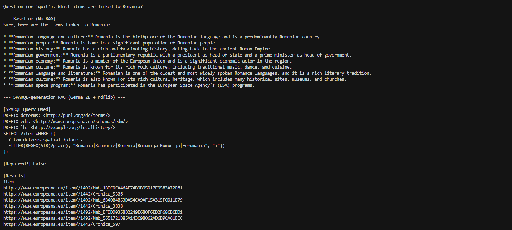

# Web Mining and Semantics - End-of-Year Project

Domain: **Local History** (monuments, historical figures, places)

This document includes **project structure**, **installation**, **hardware requirements**, **how to run each module**, **how to run the RAG demo**, and a **screenshot**.

## Project structure 

```
project-root/
├─ src/
│  ├─ crawl/      # Phase 1: crawling
│  ├─ ie/         # Phase 1: NER + relation extraction
│  ├─ kg/         # Phase 2: KB build, entity linking, predicate alignment, expansion
│  ├─ kge/        # Phase 3: SWRL + KGE (`phase3_knowledge_reasoning.ipynb`)
│  └─ rag/        # Phase 4: RAG with SPARQL
├─ data/          # Phase 1–2 pipeline outputs (regenerated by scripts)
│  ├─ crawler_output.jsonl
│  ├─ extracted_triples.csv
│  ├─ extracted_knowledge.csv
│  ├─ kb_initial.ttl
│  └─ README.md
├─ kg_artifacts/
│  ├─ ontology.ttl
│  ├─ kb_expanded.nt
│  ├─ alignment.ttl
│  ├─ mapping_table.csv
│  ├─ statistics_report.txt
│  ├─ family.owl
│  ├─ kge_splits/   # train/valid/test splits + KGE run artifacts
│  └─ ...
├─ reports/
│  └─ report.tex
├─ screenshots/
├─ run_pipeline.py
├─ config.py
├─ README.md
├─ requirements.txt
├─ .gitignore
└─ LICENSE
```

## Installation

1. **Python dependencies**
   ```bash
   pip install -r requirements.txt
   ```
2. **spaCy model** (used in Phase 1 extraction)
   ```bash
   python -m spacy download en_core_web_trf
   ```
   If `en_core_web_trf` is too large (~500 MB), use: `python -m spacy download en_core_web_sm`

3. **Europeana API key**: request a free key at [Europeana Pro API](https://pro.europeana.eu/page/get-api), then set `EUROPEANA_API_KEY` in a `.env` file or in your environment (see project `config` / crawler).
IMPORTANT: I have provided my own API key (it is free, so I have no issue sharing it). You will find it in a .txt file placed on DVL.

4. **Ollama** (RAG demo, Phase 4): install from [ollama.ai](https://ollama.ai/), then pull the model used by the demo:
   ```bash
   ollama pull gemma:2b
   ```

## Hardware requirements

- **RAM:** ≥ 8 GB recommended
- **Disk:** ~2 GB for models (spaCy transformer ~500 MB, Gemma 2B ~1.5 GB)
- **Phase 3 (KGE / notebook):** CPU is sufficient; GPU optional for faster training

## How to run each module

(For the TD1 and TD4, I recommand you to run the full pipeline script directly)
Run commands from the **repository root** (`project-root/`).

| Module | What it does | Command |
|--------|----------------|--------|
| **Crawl** | Phase 1: fetch documents (Europeana) | `python src/crawl/phase1_crawler.py` |
| **IE** | Phase 1: NER + relation extraction → CSV / JSONL under `data/` | `python src/ie/phase1_extraction.py` |
| **Build KB** | Phase 2: initial KB (TTL) | `python src/kg/phase2_build_kb.py` |
| **Entity linking** | Phase 2: link entities | `python src/kg/phase2_entity_linking.py` |
| **Predicate alignment** | Phase 2: align predicates | `python src/kg/phase2_predicate_alignment.py` |
| **KB expansion** | Phase 2: expand KB (SPARQL / options) | `python src/kg/phase2_expand_kb.py` — option: `--quick` (500 records, skip SPARQL) |
| **Knowledge reasoning** | Phase 3: SWRL + KGE notebook | Open and run all cells in `src/kge/phase3_knowledge_reasoning.ipynb` (Jupyter or VS Code) |
| **RAG** | Phase 4: RAG with SPARQL-backed generation | See [How to run the RAG demo](#how-to-run-the-rag-demo) below |
| **Full pipeline** | Phases 1–2 end-to-end | `python run_pipeline.py` |

### Seed URLs / data sources (Phase 1)

We use the **Europeana Search API** with queries: `Paris history`, `Notre-Dame Paris`, `Eiffel Tower`, `Louvre Museum`, `Palace of Versailles`, `Arc de Triomphe Paris`, `Bastille Paris`, `Sainte-Chapelle Paris`. Items with ≥500 words are kept.

## How to run the RAG demo

1. **Install Ollama** and ensure the **`gemma:2b`** model is available (see [Installation](#installation)).
2. **Start the Ollama server** (if it is not already running as a background service).
3. **Run the Gemma model** in a terminal so inference is ready (or use your usual Ollama workflow):
   ```bash
   ollama run gemma:2b
   ```
   Leave Ollama running; in **another** terminal, from the repo root:
4. **Launch the RAG script:**
   ```bash
   python src/rag/lab_rag_sparql_gen.py
   ```
   Follow the script’s prompts. Ensure KB / SPARQL-related paths expected by `src/rag/` match your local `kg_artifacts/` (see `src/rag/README.md` if present).

**Note** : here is an example of a question to enter : "Which items are linked to Romania?"

## Statistics

Statistics: `kg_artifacts/statistics_report.txt`  
Expanded KB: `kg_artifacts/kb_expanded.nt`

## Livrables (`kg_artifacts/`)

| File | Description |
|------|-------------|
| `kb_expanded.nt` | Expanded KB (N-Triples) |
| `ontology.ttl` | Ontology for new entities |
| `alignment.ttl` | Entity and predicate alignments |
| `mapping_table.csv` | Private entity → Wikidata URI mapping |
| `statistics_report.txt` | KB statistics |
| `kge_splits/train.txt` | KGE training split (triples) |
| `kge_splits/valid.txt` | KGE validation split (triples) |
| `kge_splits/test.txt` | KGE test split (triples) |

## Report

```bash
cd reports && pdflatex report.tex
```
You can also see it as a PDF on DVL.

## Screenshot

RAG demo (output / UI illustration) — image synchronisée depuis `C:\Users\sulta\OneDrive\Bureau\Rag_example.png` :


